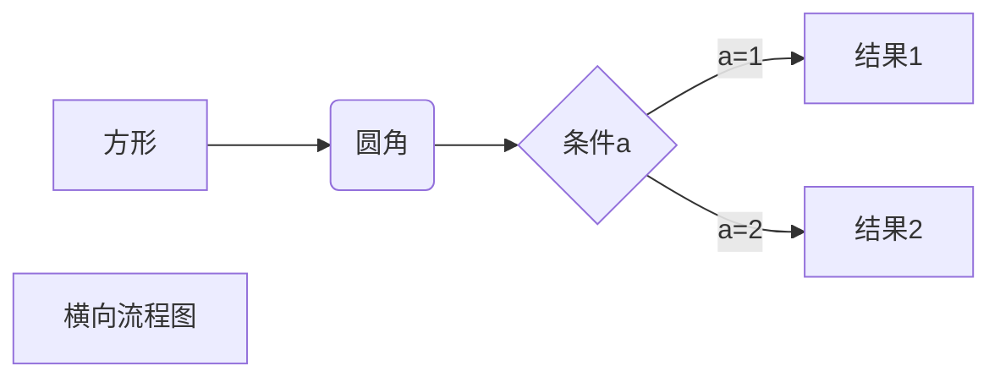
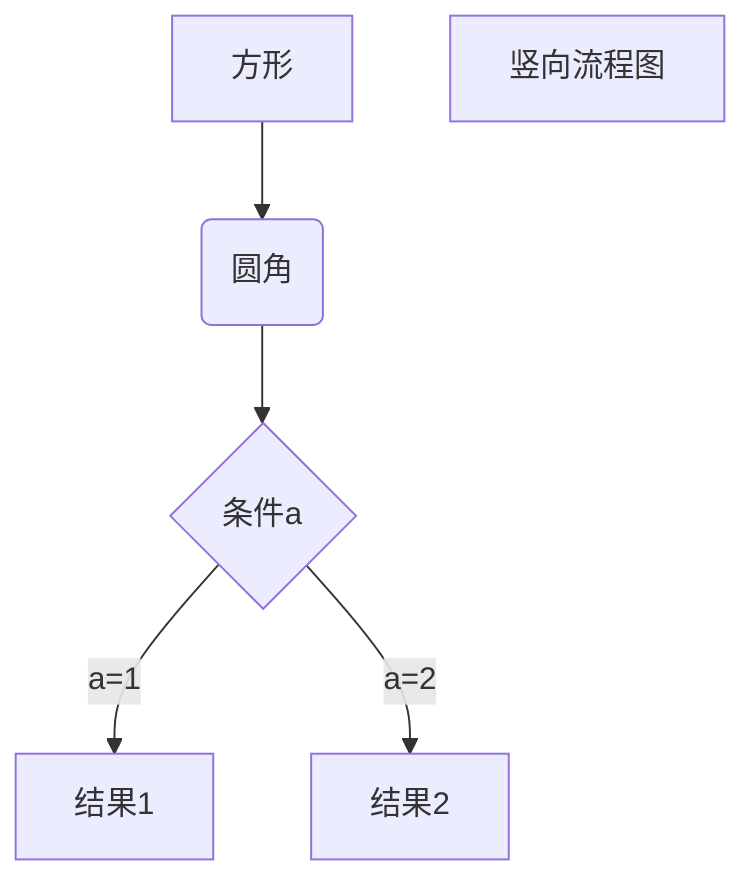
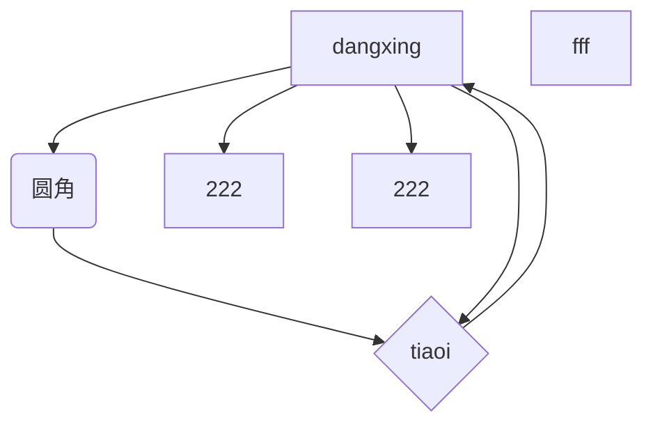

预览

换行 打空格


加粗


**发**

分割线
***

~~删除线~~

<u>下划线</u>


- 无序列表

1. 有序列表

1. 列表嵌套
    - 嵌套
    1. 嵌套
> 区块
>> 二层


> 区块加列表
> 1. 第一项
> - 第二项

`代码`高亮

    const a = 90
    console.log(a)

```jacascript
const a = 90
```

[链接](www.baidu.com)






