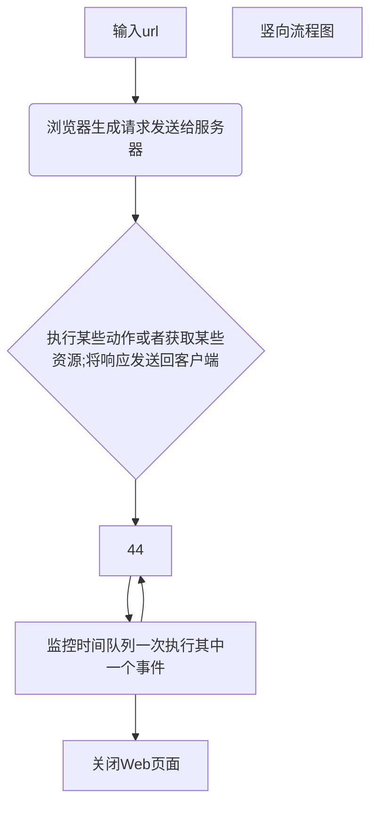
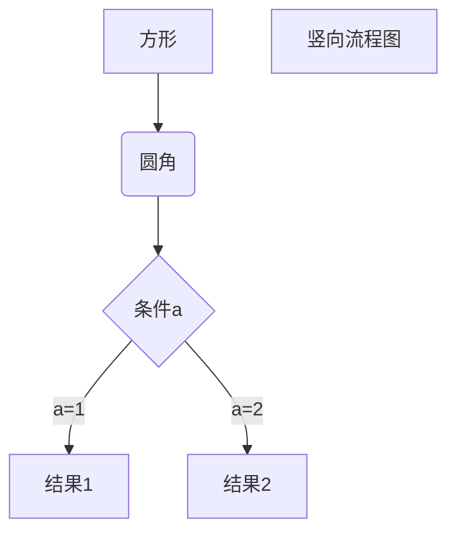

## 用户输入url发生了什么

```mermaid
graph TD
A[输入url] --> B(浏览器生成请求发送给服务器)
    B --> C{执行某些动作或者获取某些资源;将响应发送回客户端}
    C --> D[执行Html、css、Js并构建结果页面]
    D --> E[监控时间队列一次执行其中一个事件]
    E --> D[44]
    E --> G[关闭Web页面]
    F[竖向流程图]
```

```mermaid
graph TD
A[方形] --> B(圆角)
    B --> C{条件a}
    C --> |a=1| D[结果1]
    C --> |a=2| E[结果2]
    F[竖向流程图]
```
